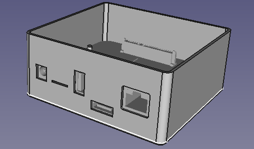
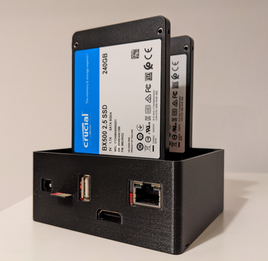
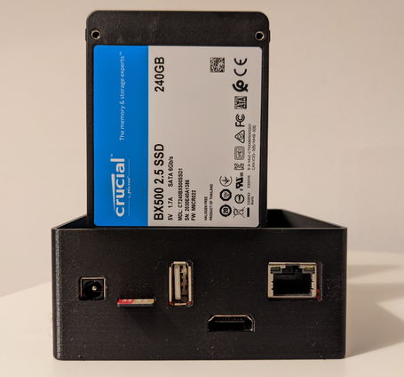

### Odroid HC 4 basic enclosure KiCAD 0.16 project

The design was built using:
* original DXF https://wiki.odroid.com/odroid-hc4/hardware/hardware#schematics_drawings_and_s905x3_datasheet
* 3D model kindly built by hominoid https://forum.odroid.com/viewtopic.php?f=53&t=33823&p=246204#p246204

**Disclaimer: I haven't tried it with the real board - it is still on the way to me :) Will update the project in case of any dimensional errors**

3D printed on Creality Ender 3V2

